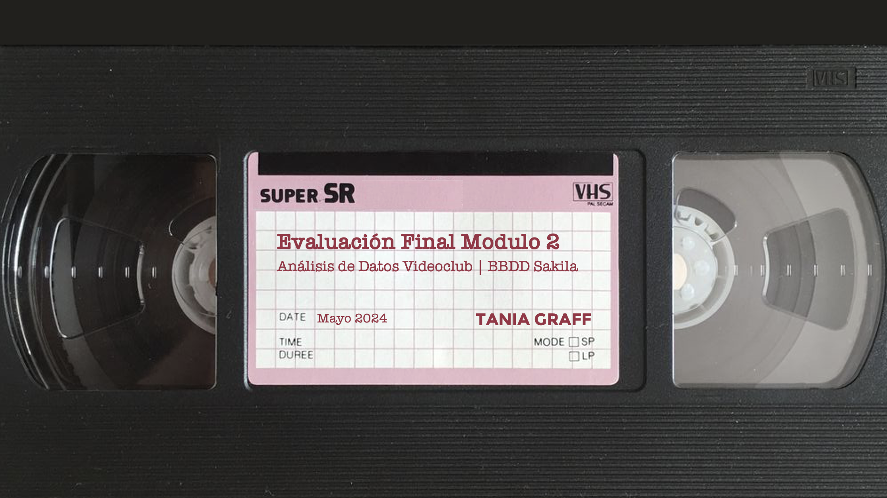

# Evaluación Final Módulo 2
## Análisis de Datos de Películas con la Base de Datos Sakila
**Tania Graff** | Promo A Part Time

**Consultas SQL.**
En esta evaluación se utiliza la base de datos Sakila, que simula una tienda de alquiler de películas, para realizar las consultas SQL necesarias para extraer y analizar los datos almacenados en sus 17 tablas. 

**Final Evaluation for Module 2.** Movie Data Analysis with the Sakila Database

**SQL Queries.**
This evaluation uses the Sakila database, which simulates a movie rental store, to perform the SQL queries necessary to extract and analyze the data stored in its 17 tables.
